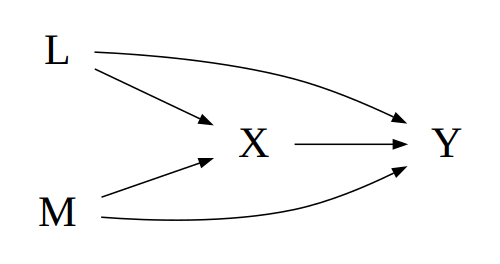

# Functionalizing Code

```{r setup, include = FALSE}
pacman::p_load(tibble, broom, purrr)
```

Functions are extremely useful tools in R. They power the packages we rely on and the statistical analyses we run.

In addition, we can write our own bespoke functions to handle repetitive operations or to make our analyses more flexible. Gaining intuition with writing functions takes time, but hopefully a simple example will suffice to demonstrate their usefulness.

In the following example, we'll look at an example in which we want to run a logistic regression repeatedly, feeding it different sets of independent variables.

## Simulate Data

Let's begin by simulating some fake data.

In the code below, we simulate a dataset containing 500 rows and encoding the following relationships between the variables *L*, *M*, *X*, and *Y*, where *Y* is some outcome and *i* is used as the participant ID.

For simplicity, all variables (besides *i*) are binary, taking either 1 or 0 as their value.

$$
\begin{split}
	L & \sim \text{Binomial}\big(0.3\big) \\
	M & \sim \text{Binomial}\big(0.6\big) \\
	X & \sim \text{Binomial}\big(0.3 + 0.2L + 0.2M\big) \\
	Y & \sim \text{Binomial}\big(0.05 + 0.2L + 0.4M + 0.05X\big)
\end{split}
$$

```{r sim}
# simulate some data
n <- 500

set.seed(3498743)

df <- tibble(
  i = 1:n,
  l = rbinom(n, 1, 0.3),
  m = rbinom(n, 1, 0.6),
  x = rbinom(n, 1, 0.3 + 0.2 * l + 0.2 * m),
  y = rbinom(n, 1, 0.05 + 0.2 * l + 0.4 * m + 0.05 * x)
)

print(df)
```

<span class="marginnote">**What Did We Simulate?**</span>

```{r dag, message = F, echo = F, fig.margin = T, fig.width = 5, out.width = "75%", fig.cap = "Assuming we understand the relationships simulated in the prior section as causal, we can represent them using a causal directed acyclic graph (DAG). Don't worry about DAGs for the purposes of this guide. We just want to tie a causal diagram to its simulation and note that simulating such examples can be useful when studying causal inference."}
# install.packages("devtools")
# devtools::install_github("jrgant/quickdag")

# view the DAG the above simulation implies
library(quickdag)
edges <- c("L -> { X Y }",
           "M -> { X Y }",
           "X -> Y")

qd_dag(edgelist = edges, check.dag = F, verbose = F) %>%
  export_graph(file_name = "images/simdag.png",
							 file_type = "png",
						 	 width = 500)


```

## The Old Way

Let's say we are interested in estimating the effect of some exposure *X* on some outcome *Y* under different assumptions about the set of relevant adjustment covariates.

We could simply rewrite code individually for each of our analyses of interest.

```{r old}
# run analyses using different independent covariates
fit1 <- glm("y ~ x", data = df, family = binomial())
fit2 <- glm("y ~ x + l", data = df, family = binomial())
fit3 <- glm("y ~ x + l + m", data = df, family = binomial())

# view model summaries
# broom::tidy()
tidy(fit1, exponentiate = TRUE)
tidy(fit2, exponentiate = TRUE)
tidy(fit3, exponentiate = TRUE)
```

The code above works just fine, but it violates one of the truly helpful heuristics in programming: **Don't Repeat Yourself (DRY)**. Basically, the idea is that if you find yourself reusing blocks of code repeatedly, put that code into a _function_ that you write once instead of *n* times.

Adhering to the DRY heuristic can help the coder in several ways:

1. Write more elegant, readable code.
2. Make fewer coding mistakes, and facilitate debugging.
3. Update or make changes to analyses more easily.


## A New Way, Part 1

One approach to functionalizing our analysis would be to write a function that takes a single argument, the right-hand side (RHS) of the models we'd like to run. Then, we could simply run the function three times, feeding in each covariate set directly


```{r new1}

regfun <- function(vars) {
  fit <- glm(paste0("y ~ ", vars), data = df, family = binomial())
  tidy(fit, exponentiate = TRUE)
}

# run analyses
regfun("x")
regfun("x + l")
regfun("x + l + m")

```

## A New Way, Part 2

If we tried to be a little more elegant, we might try to avoid repeated calls to the `regfun()` function. Let's write some code that loops through a vector of RHS options and spits out each analysis.

```{r new2}
## specify the righthand side equations we'd like to test
rhs <- c("x",
         "x + l")
```

### Loop Method 1

```{r loop1}
## purrr::map()
map(rhs, .f = function(x) regfun(vars = x))
```

### Loop Method 2

```{r loop2}
for (i in seq_along(rhs)) {
  print(regfun(rhs[i]))
}
```

### Add a New Analysis

What if you want to add a new analysis? Easy!

Of course, you'd probably just add the new covariate set to the `rhs` vector above and rerun thecode, but for the sake of exposition:

```{r new2_add}
rhs2 <- c(rhs, "x + l + m")
map(rhs2, .f = function(x) regfun(vars = x))

```


## A New Way, Part 3

If you know you're going to run `regfun()` multiple times, build looping into the function from the start and write even less!

```{r new3}

regfun_looper <- function(vars) {
  # purrr::map()
  map(vars, .f = function(x = vars) {
    fit <- glm(paste0("y ~ ", x), data = df, family = binomial())
    tidy(fit, exponentiate = TRUE)
  })
}

## voila!
regfun_looper(rhs2)

```


## Approximate in SAS

The code below provides a SAS approximation of "A New Way, Part 1".

### Simulate Data

```{r, include = F}
SASmarkdown::sas_collectcode()
```

```{sas macro-example, collectcode = TRUE}

* SIMULATE DATA =============================================== ;

%let n = 500;

data sim;
	call streaminit(341324);
	do i=1 to &n;
		l = rand('Bernoulli', 0.3);
		m = rand('Bernoulli', 0.6);
		x = rand('Bernoulli', 0.3 + 0.2 * l + 0.2 * m);
		y = rand('Bernoulli', 0.05 + 0.2 * l + 0.4 * m + 0.05 * x);
		output;
	end;
run;

proc print data=sim(obs=20); run;

* RUN FIRST LOGISTIC REGRESSION MODEL ======================== ;

title "FIRST LOGISTIC REGRESSION MODEL";
proc genmod data=sim;
	model y(ref='0') = x / dist=bin link=logit;
	estimate 'x effect' x 1 /exp;
run;

* RUN SECOND LOGISTIC REGRESSION MODEL ===== ;

title "SECOND LOGISTIC REGRESSION MODEL";
proc genmod data=sim;
	model y(ref='0') = x l / dist=bin link=logit;
	estimate 'x effect, ctrl l' x 1 /exp;
run;
title;

* WRITE A MACRO THAT TAKES INPUTS =========================== ;

* In SAS macros are somewhat analagous to R functions. ;

%macro regfun(vars=, estname=, fitnum=);

	proc genmod data=sim;
		model y(ref='0') = &vars / dist=bin link=logit;
		estimate &estname x 1 /exp;
	run;

%mend regfun;

title "FIRST RUN OF THE REGFUN MACRO";
%regfun(vars = x, estname = 'x effect', fitnum = fit1);

title "SECOND RUN OF THE REGFUN MACRO";
%regfun(vars = x, estname = 'x effect, ctrl l', fitnum = fit2);
title;
```
